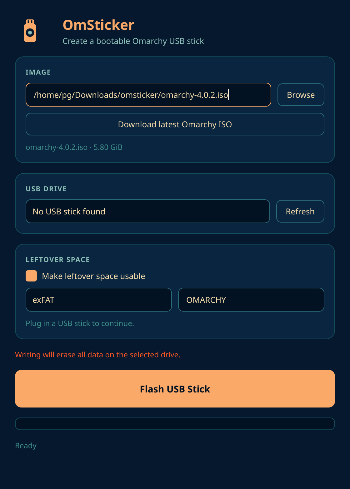

# OmSticker

Qt6 USB creator for [Omarchy](https://omarchy.org/). It writes a bootable Omarchy ISO to a USB stick and turns the leftover space into a usable data partition.



## Features

- Writes the Omarchy ISO as a hybrid image so the stick stays BIOS/UEFI bootable
- Formats leftover space with a filesystem you choose: exFAT, FAT32, NTFS, ext4, Btrfs, F2FS, or XFS
- Downloads the latest Omarchy ISO (shows version, speed, and ETA) to `~/Downloads/omsticker/`
- Lists removable USB drives and refuses to write to system disks
- Progress, throughput, and time remaining for both download and write
- Abort a write in progress (the stick is incomplete until you flash again)
- Resume or start again after an abort, using synced checkpoints
- Uses UDisks2, so you do not need a root-installed helper

## Requirements

- Qt 6 (Widgets, Network, DBus)
- libfdisk (`util-linux`)
- UDisks2 and a polkit agent
- `mkfs` tools for the filesystems you want (exFAT, FAT32, ext4, and Btrfs are typical on Omarchy)

## Build

```bash
qmake6 omsticker.pro
make -j$(nproc)
```

Binaries land in `build/`:

```bash
./build/omsticker
```

Optional system install:

```bash
sudo make install
```

### Omarchy / Arch package

Omarchy is Arch-based, so ship OmSticker as a normal Arch package (`PKGBUILD` in this repo).

1. Bump `pkgver` / `pkgrel` in `PKGBUILD` when you release.
2. Build and install locally:

```bash
makepkg -si
```

That installs `/usr/bin/omsticker`, `/usr/lib/omsticker/omsticker-helper`, the desktop entry, icon, and polkit policy.

3. To distribute: publish the PKGBUILD on the [AUR](https://aur.archlinux.org/), or add the package to a personal/Omarchy repo (`repo-add` + pacman). Omarchy’s own image only picks it up if it is added to the Omarchy packaging tree.
4. Runtime depends: `qt6-base`, `qt6-svg`, `udisks2`, `util-linux` (libfdisk), `polkit`, plus `mkfs` tools (`exfatprogs`, `dosfstools`, `e2fsprogs`; optional NTFS/Btrfs/XFS/F2FS).

## Usage

1. Plug in a USB stick.
2. Choose an ISO, or download the latest Omarchy image.
3. Pick the drive and leftover filesystem (exFAT is a good default).
4. Flash. Confirm the destructive write.

Omarchy needs Secure Boot / TPM off in firmware to boot the stick.

Aborting or killing the write leaves the stick unbootable until you resume or flash it again. Resume only works for the same ISO and the same USB.

## How leftover space works

The ISO is written raw. OmSticker then relocates the GPT backup header to the end of the drive and adds a data partition in the free space, so the rest of the stick can be used for files.

## License

MIT. See [LICENSE](LICENSE).
